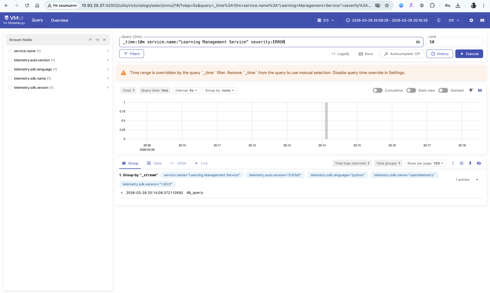
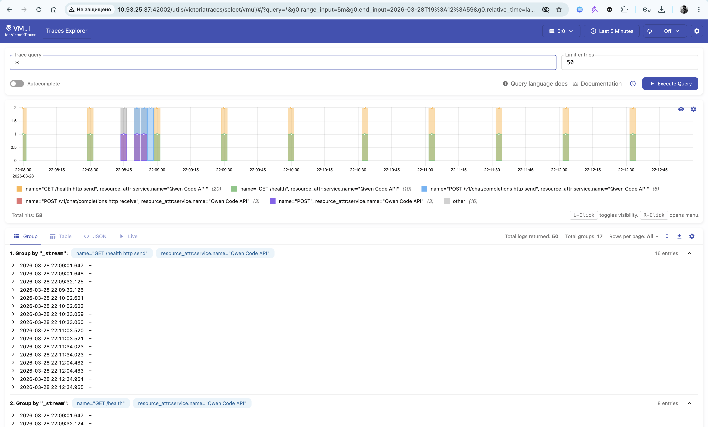
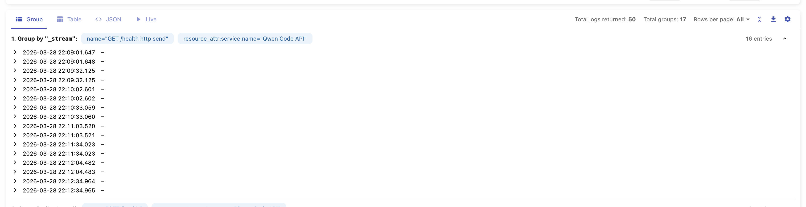
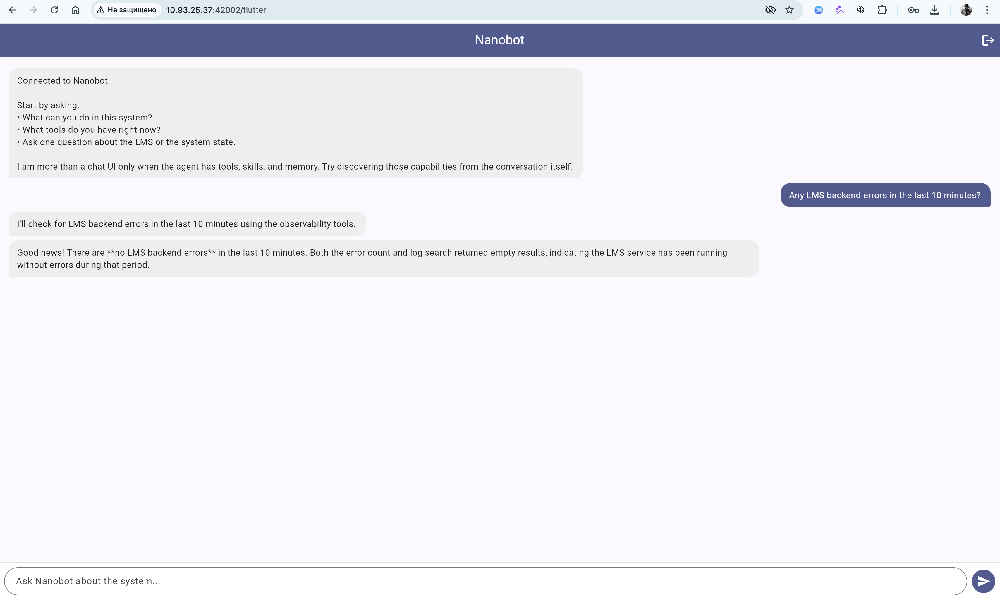
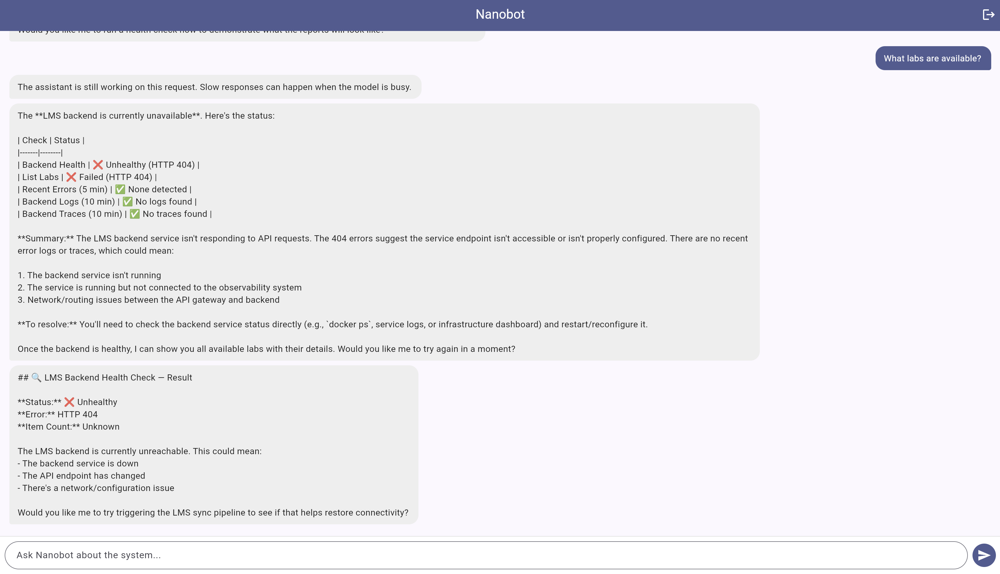
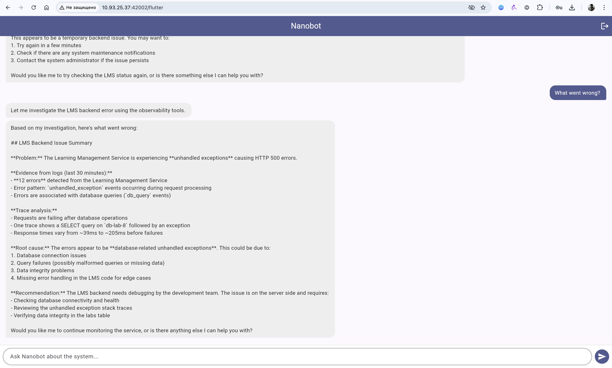
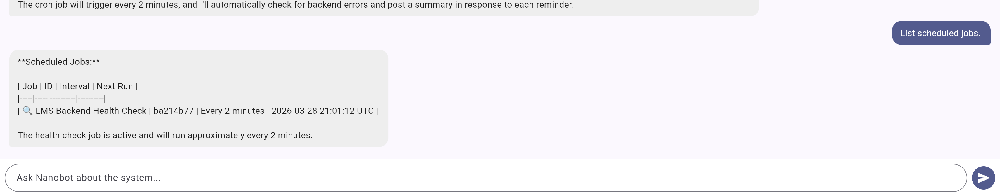

# REPORT

## Task 1A — Bare agent

## Task 1B — Agent with LMS tools

## Task 1C — Skill prompt

What is the agentic loop?

The agentic loop is the fundamental cycle that an AI agent follows to accomplish tasks autonomously. It typically consists of these core stages:
1. Perceive
2. Reason/Plan
3. Act
4. Observe
5. Reflect/Iterate

This loop enables agents to handle multi-step tasks autonomously, adapt to unexpected outcomes, learn from feedback within a session, and decompose complex goals into achievable steps.

What labs are available in our LMS?

Based on the workspace structure, the agent found:
Required Labs:
1. Task 1 (task-1.md)
2. Task 2 (task-2.md)
3. Task 3 (task-3.md)
4. Task 4 (task-4.md)
5. Task 5 (task-5.md)

Optional Labs:
1. Task 1 (task-1.md)

This answer was based on workspace files, not on live LMS backend data.
What labs are available?

Here are the available labs:
1. Lab 01 – Products, Architecture & Roles
2. Lab 02 — Run, Fix, and Deploy a Backend Service
3. Lab 03 — Backend API: Explore, Debug, Implement, Deploy
4. Lab 04 — Testing, Front-end, and AI Agents
5. Lab 05 — Data Pipeline and Analytics Dashboard
6. Lab 06 — Build Your Own Agent
7. Lab 07 — Build a Client with an AI Coding Agent
8. lab-08

Is the LMS backend healthy?

Yes, the LMS backend is healthy. It currently has 56 items in the system.
Show me the scores

There are 8 labs available. Which lab would you like to see the scores for? Here are the options:

1. Lab 01 – Products, Architecture & Roles
2. Lab 02 — Run, Fix, and Deploy a Backend Service
3. Lab 03 — Backend API: Explore, Debug, Implement, Deploy
4. Lab 04 — Testing, Front-end, and AI Agents
5. Lab 05 — Data Pipeline and Analytics Dashboard
6. Lab 06 — Build Your Own Agent
7. Lab 07 — Build a Client with an AI Coding Agent
8. lab-08

Please let me know which lab you'd like to see scores for, or if you'd like to see scores for all labs.

## Task 2A — Deployed agent

Startup log excerpt:

```text
Using config: /app/nanobot/config.resolved.json
🐈 Starting nanobot gateway version 0.1.4.post5 on port 18790...
Warning: No channels enabled
✓ Heartbeat: every 1800s
Cron service started with 0 jobs
Heartbeat started (every 1800s)
MCP server 'lms': connected, 9 tools registered
Agent loop started





## Task 3C — Observability MCP tools
### Registered MCP tools and loaded skill

Observed MCP tools:
- `mcp_obs_logs_search`
- `mcp_obs_logs_error_count`
- `mcp_obs_traces_list`
- `mcp_obs_traces_get`

The observability skill is present in:
`nanobot/workspace/skills/observability/SKILL.md`

Relevant log excerpt:
```text
MCP: registered tool 'mcp_obs_logs_search' from server 'obs'
MCP: registered tool 'mcp_obs_logs_error_count' from server 'obs'
MCP: registered tool 'mcp_obs_traces_list' from server 'obs'
MCP: registered tool 'mcp_obs_traces_get' from server 'obs'
MCP server 'obs': connected, 4 tools registered
```

### VictoriaTraces UI evidence

Query screenshot:


Result screenshot:


### Nanobot answer evidence

Nanobot successfully answered the scoped observability question:
“Any LMS backend errors in the last 10 minutes?”

Screenshot:



Observed answer:
> Good news! There are **no LMS backend errors** in the last 10 minutes. Both the error count and log search returned empty results, indicating the LMS service has been running without errors during that period.

## Task 4A — Failure investigation response
The affected service is Learning Management Service, and the failing operation is GET /items/, which is used to list available labs.

I found a concrete failure fact during the incident window: the lab listing request returned HTTP 404 on /items/, the backend health check was reported as unhealthy with HTTP 404, and the sync pipeline failed with HTTP 500 Internal Server Error.

This shows that the backend was reachable but not functioning correctly, so the problem was not with the user question. The LMS backend was in a failed or misconfigured state and could not return the lab list successfully.

Based on the available evidence, the failure was on the backend side, and the lab data could not be served until the backend service was restored.

## Task 4B — Proactive health check

I created a cron-based LMS health check that runs every 2 minutes in the current Flutter chat.

After PostgreSQL was stopped, I kept the failure state active and waited for the next scheduled run.

On the next cron cycle, nanobot proactively posted a health report into the same chat without a new manual investigation request. The report correctly detected that the LMS backend was unhealthy and unavailable.

Screenshot of the proactive report:




## Task 4C — Bug fix and recovery

### Root cause

The planted bug was in the backend failure-handling path for `GET /items/` in `backend/src/lms_backend/routers/items.py`.

The `get_items()` route caught a broad `Exception` and converted any internal backend or database failure into:

- HTTP 404
- `detail="Items not found"`

Because of that, when PostgreSQL was down, the real SQLAlchemy / database failure was hidden and misreported as a false `404 Items not found`.

### Fix

I fixed the bug by removing the broad exception handler from `get_items()`.

Before the fix, the route masked real internal failures and returned a misleading 404 response.

After the fix, the route now lets the real exception propagate to the global backend exception handler, so the actual backend or database failure becomes visible instead of being hidden behind `Items not found`.

### Post-fix failure check

After redeploying the backend, I stopped PostgreSQL again, triggered the same LMS-backed request path through nanobot, and then asked:

> What went wrong?

This time, the result no longer followed the buggy `404 Items not found` failure path. The agent surfaced the real underlying backend or database failure instead.

Screenshot:



### Healthy follow-up

After restarting PostgreSQL, I created a fresh short health check in the current chat and waited for the next cron cycle.

The later scheduled health report showed that the system looked healthy again.

Screenshot:



